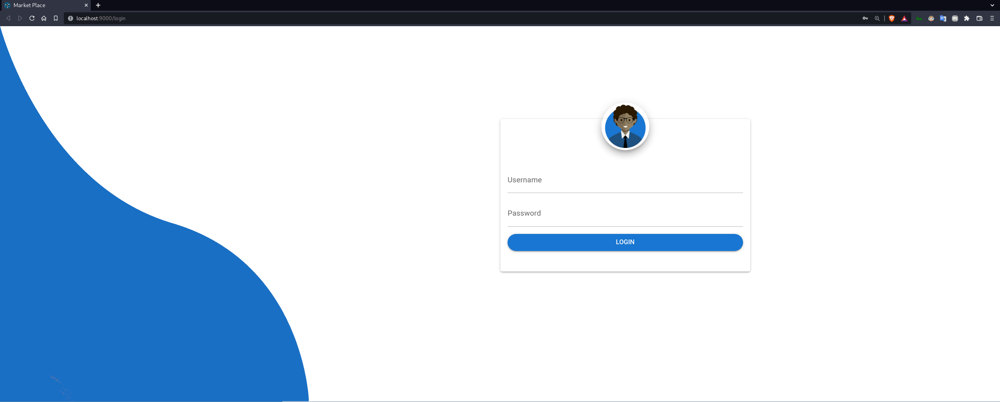
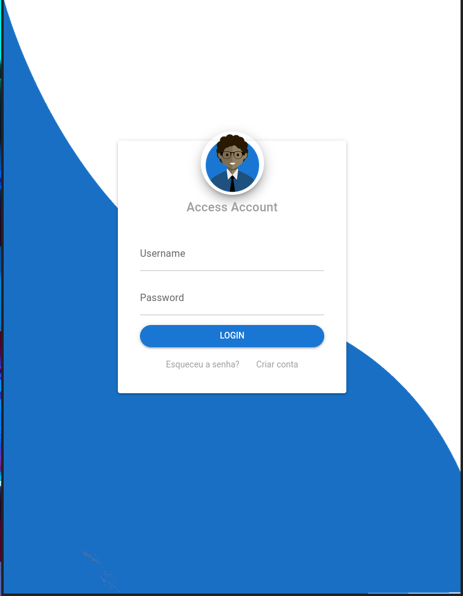

<h1 align="center"> Market Place Client </h1>
<h5 align="center" font-weigth="bold">  This is frontend side of my Market Place application </h5>

 

  
  

  
  
  
  

  <!---  -->
  

### Main technologies used
  
 
    
- [Typescript](https://www.typescriptlang.org/) - TypeScript is a programming language developed and maintained by Microsoft. It is a strict syntactical superset of JavaScript and adds optional static typing to the language. TypeScript is designed for the development of large applications and transcompiles to JavaScript.

- [Vue.js](https://vuejs.org/) - Vue.js is an open-source model–view–viewmodel front end JavaScript framework for building user interfaces and single-page applications. It was created by Evan You, and is maintained by him and the rest of the active core team members.

- [Quasar](https://quasar.dev/) - Quasar Framework is an open-source Vue.JS based framework for building apps, with a single codebase, and deploy it on the Web as a SPA, PWA, SSR, to a Mobile App, using Cordova for iOS & Android, and to a Desktop App, using Electron for Mac, Windows, and Linux. .

