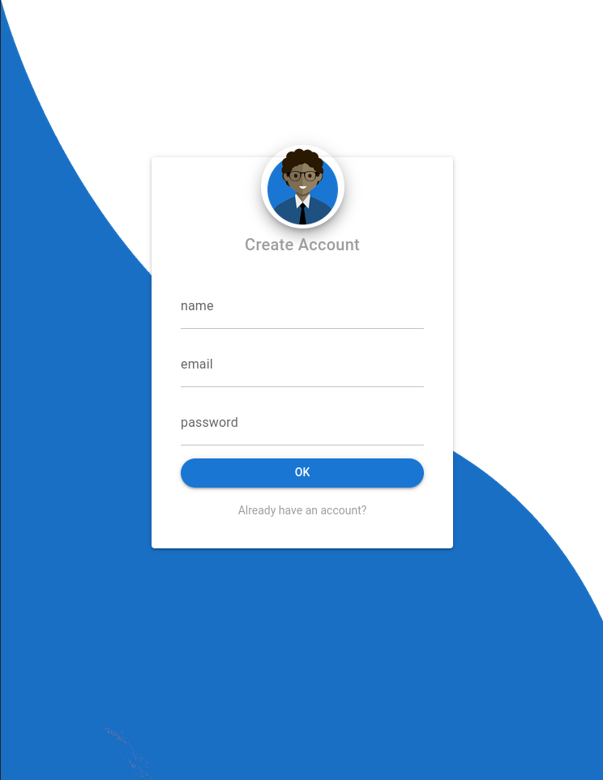

# Market Place Client

The client side of market place application


## Features

- Authentication
- Create User
- Create Products
- Create Orders
- Products Table
- Orders table
- User Info Page


## Screenshots
<div style="display: flex; width: 100%;">
 
 


</div>


## Installation

Install dependencies

```bash
  yarn install
```

Run project

```bash
  yarn dev
```
    
## Main technologies used

- [Typescript](https://www.typescriptlang.org/) - TypeScript is a programming language developed and maintained by Microsoft. It is a strict syntactical superset of JavaScript and adds optional static typing to the language. TypeScript is designed for the development of large applications and transcompiles to JavaScript.

- [Vue.js](https://vuejs.org/) - Vue.js is an open-source model–view–viewmodel front end JavaScript framework for building user interfaces and single-page applications. It was created by Evan You, and is maintained by him and the rest of the active core team members.

- [Quasar](https://quasar.dev/) - Quasar Framework is an open-source Vue.JS based framework for building apps, with a single codebase, and deploy it on the Web as a SPA, PWA, SSR, to a Mobile App, using Cordova for iOS & Android, and to a Desktop App, using Electron for Mac, Windows, and Linux.
## Authors

- [Gerssivado Santos](https://www.github.com/gerssivaldosantos)

